# Reservation Creation Flow

This flowchart shows the complete process of creating a reservation from initial request to final confirmation.

```mermaid
flowchart TD
    Start([User Initiates Reservation]) --> CheckAuth{User Authenticated?}

    CheckAuth -->|Yes| GetUser[Retrieve User Info]
    CheckAuth -->|No| GuestInfo[Collect Guest Info]

    GetUser --> SelectFacility[Select Facility]
    GuestInfo --> SelectFacility

    SelectFacility --> CheckAvailability{Check Facility<br/>Availability}

    CheckAvailability -->|Not Available| ShowError1[Show Error:<br/>Facility Not Available]
    ShowError1 --> SelectFacility

    CheckAvailability -->|Available| SelectPeriod[Select Booking Period<br/>Start & End DateTime]

    SelectPeriod --> CalculatePrice[Calculate Pricing<br/>- Base Rate<br/>- Service Fee<br/>- Tax<br/>- Discounts]

    CalculatePrice --> AddOns{Add Optional<br/>Add-ons?}

    AddOns -->|Yes| SelectAddons[Select Add-ons<br/>Calculate Add-on Fee]
    AddOns -->|No| AddGuests

    SelectAddons --> AddGuests[Add Guest Information<br/>Update Guest Count]

    AddGuests --> CalculateTotal[Calculate Total Amount<br/>Subtotal + Charges + Tax]

    CalculateTotal --> CreateReservation[Create Reservation Record<br/>Status: PENDING<br/>Generate Confirmation Code<br/>Generate Reservation Number]

    CreateReservation --> SaveGuests[Save Guest Records<br/>Link to Reservation]

    SaveGuests --> MatchEvent{Create Match Event?<br/>For Sports/Activities}

    MatchEvent -->|Yes| CreateMatch[Create Match Event<br/>Link to Reservation<br/>Status: DRAFT]
    MatchEvent -->|No| ConfirmReservation

    CreateMatch --> SetMatchDetails[Set Match Details<br/>- Max Participants<br/>- Skill Level<br/>- Public/Private]

    SetMatchDetails --> ConfirmReservation[Confirm Reservation<br/>Status: CONFIRMED]

    ConfirmReservation --> UpdateFacility[Update Facility Status<br/>to RESERVED]

    UpdateFacility --> SendConfirmation[Send Confirmation Email<br/>with Confirmation Code]

    SendConfirmation --> End([Reservation Complete])

    style Start fill:#e1f5e1
    style End fill:#e1f5e1
    style ShowError1 fill:#ffe1e1
    style CreateReservation fill:#e1e5ff
    style CreateMatch fill:#fff4e1
```

## Flow Steps Explained

### 1. Authentication Check

- **Authenticated Users**: System retrieves user information from database
- **Guest Users**: System collects basic information (name, email, phone)

### 2. Facility Selection

- User browses available facilities
- Can filter by type, location, amenities, price range

### 3. Availability Check

- System validates facility is not already booked
- Checks facility status (AVAILABLE, not in MAINTENANCE, etc.)
- Verifies selected time period is valid

### 4. Pricing Calculation

The system calculates:

- **Base Rate**: From RateType (hourly/daily/weekly/monthly)
- **Service Fee**: Platform or facility service charges
- **Tax**: Applicable taxes (default 12%)
- **Discounts**: Coupon codes or promotional discounts

### 5. Add-ons (Optional)

- Equipment rental (sports gear, AV equipment, etc.)
- Catering services
- Additional amenities
- Each add-on adds to the total cost

### 6. Guest Management

- Primary guest information (from authenticated user or manual entry)
- Additional guests can be added
- Guest count tracked at reservation level
- Individual guest records created and linked

### 7. Reservation Creation

Creates reservation record with:

- **Confirmation Code**: Unique CUID (e.g., `clx1a2b3c4d5e6f7g8h9i0j1`)
- **Reservation Number**: Human-friendly format (e.g., `SP520260107FB042`)
- **Status**: Initially set to `PENDING`
- **Complete Pricing Breakdown**: All calculated amounts stored

### 8. Match Event Creation (Sports/Activities Only)

For facilities like courts, fitness areas:

- Creates linked MatchEvent record
- Sets participant limits (min/max)
- Configures public/private visibility
- Enables waitlist management
- Sets approval workflow (auto-accept or manual)

### 9. Confirmation

- Updates facility status to `RESERVED`
- Sends confirmation email with:
    - Confirmation code
    - Reservation details
    - Check-in instructions
    - Payment information (if applicable)

## Error Handling

- **Facility Unavailable**: Returns to facility selection
- **Invalid Time Period**: Shows validation error
- **Payment Failure**: Keeps reservation in PENDING state
- **Booking Conflict**: Shows error and alternative time slots
