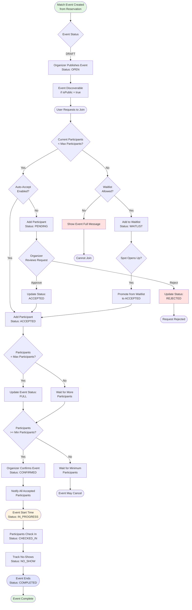

# Match Event & Participant Flow

This diagram shows the complete workflow for match events and participant management, including approval processes and waitlist handling.



## Match Event Lifecycle

### 1. Event Creation (DRAFT)
When a reservation is created for a sports/activity facility:
- MatchEvent record is created and linked to the reservation
- Event creator (reservation owner) becomes the organizer
- Initial status is `DRAFT` (not yet visible to others)
- Organizer configures:
  - **Title & Description**: e.g., "Basketball 5v5 - Competitive"
  - **Participant Limits**: Min/Max participants (e.g., 2-10)
  - **Visibility**: Public (discoverable) or Private (invite-only)
  - **Auto-Accept**: Whether join requests are automatic or require approval
  - **Waitlist**: Whether to allow waitlist when full
  - **Skill Level**: BEGINNER, INTERMEDIATE, ADVANCED
  - **Gender Preference**: MIXED, MALE, FEMALE, or ANY
  - **Age Range**: Optional age restrictions

### 2. Publishing (OPEN)
- Organizer publishes the event
- Status changes to `OPEN`
- If `isPublic = true`, event becomes discoverable by other users
- Users can browse and request to join

### 3. Participant Management

#### Join Request Process
When a user requests to join:

**A. Capacity Available**
- If `autoAccept = true`: Instantly added with status `ACCEPTED`
- If `autoAccept = false`: Added with status `PENDING`, awaits organizer approval

**B. Event Full**
- If `allowWaitlist = true`: Added to waitlist with status `WAITLIST`
- If `allowWaitlist = false`: User cannot join, shows "Event Full" message

#### Organizer Approval (Manual Mode)
For pending requests, organizer can:
- **Approve**: Participant status → `ACCEPTED`
- **Reject**: Participant status → `REJECTED`

### 4. Event Confirmation (CONFIRMED)
When participant count reaches satisfactory level:
- Organizer confirms the event
- Event status → `CONFIRMED`
- All `ACCEPTED` participants are notified
- Participant status can be updated to `CONFIRMED` when they acknowledge

### 5. Event In Progress (IN_PROGRESS)
At the scheduled start time:
- Event status → `IN_PROGRESS`
- Check-in process begins
- Participants mark themselves or are marked as `CHECKED_IN`
- System tracks `NO_SHOW` for participants who don't check in

### 6. Event Completion (COMPLETED)
At scheduled end time or manual completion:
- Event status → `COMPLETED`
- Final participant statuses recorded
- No-show tracking finalized
- Event closes for any further modifications

## Waitlist Management

### Automatic Promotion
When a spot becomes available (participant cancels or is removed):
1. System checks if anyone is on waitlist (`status = WAITLIST`)
2. Promotes first waitlisted participant by join date
3. Updates their status to `ACCEPTED`
4. Notifies the promoted participant
5. If event still has open spots, continues promoting from waitlist

### Manual Promotion
Organizer can manually:
- Select specific waitlist participants to promote
- Reorder waitlist priority
- Remove participants from waitlist

## Participant Statuses Explained

| Status | Description | Can Join Event? |
|--------|-------------|-----------------|
| `PENDING` | Awaiting organizer approval | No |
| `ACCEPTED` | Approved to join | Yes |
| `REJECTED` | Request denied | No |
| `WAITLIST` | On waitlist (event full) | If spot opens |
| `CONFIRMED` | Acknowledged participation | Yes |
| `CHECKED_IN` | Present at event | Yes |
| `NO_SHOW` | Did not attend | No |
| `LEFT` | Left event early | No |

## Match Event Settings

### Auto-Accept vs Manual Approval
- **Auto-Accept (autoAccept = true)**: 
  - Instant joining (good for casual, open events)
  - First-come, first-served
  - Less management overhead
  
- **Manual Approval (autoAccept = false)**:
  - Organizer reviews each request
  - Can check participant profile/skill level
  - Better control over event composition

### Public vs Private Events
- **Public (isPublic = true)**:
  - Discoverable in event listings
  - Anyone can request to join
  - Great for community building
  
- **Private (isPublic = false)**:
  - Hidden from public listings
  - Invitation-only (share event link)
  - For closed groups/friends

## Use Cases

### Example 1: Competitive Basketball Game
```
- Title: "5v5 Basketball - Competitive"
- Min/Max: 8-10 participants
- Skill Level: ADVANCED
- Auto-Accept: false (manual approval)
- Public: true
- Waitlist: true
```

### Example 2: Casual Tennis Match
```
- Title: "Doubles Tennis - Fun Play"
- Min/Max: 4-4 participants (exactly 4)
- Skill Level: ANY
- Auto-Accept: true
- Public: true
- Waitlist: true
```

### Example 3: Private Fitness Class
```
- Title: "Morning Yoga Session"
- Min/Max: 5-15 participants
- Auto-Accept: true
- Public: false (private invite)
- Waitlist: true
```
