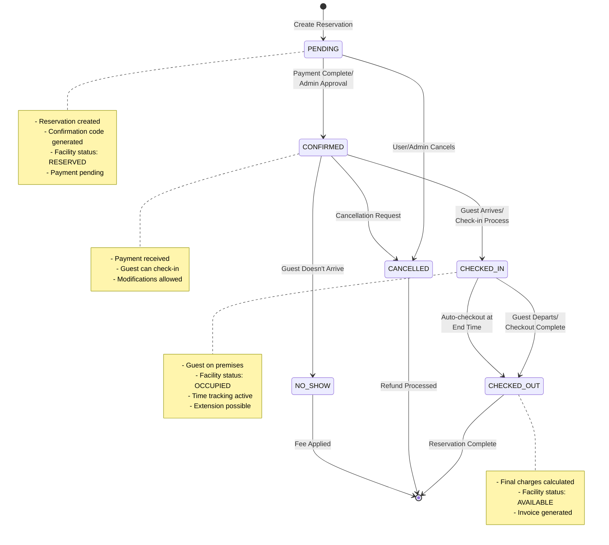

# Reservation Lifecycle State Diagram

This state diagram illustrates the complete lifecycle of a reservation from creation to completion or cancellation.



## Reservation States

### 1. PENDING
**Initial state when reservation is created**

**Characteristics:**
- Reservation record created in database
- Unique confirmation code generated (e.g., `clx1a2b3c4d5e6f7g8h9i0j1`)
- Human-friendly reservation number generated (e.g., `SP520260107FB042`)
- Facility status updated to `RESERVED`
- Guest information collected
- Pricing calculated and stored

**Facility Status:** `RESERVED`

**Transitions From PENDING:**
- → `CONFIRMED`: Payment received or admin approval granted
- → `CANCELLED`: User cancels or payment fails

**Actions Available:**
- Modify reservation details
- Update guest information
- Change booking period (if available)
- Cancel reservation
- Process payment

---

### 2. CONFIRMED
**Payment received and reservation is guaranteed**

**Characteristics:**
- Payment successfully processed
- Confirmation email sent to guest
- Guest can now check-in
- Modifications still possible (may incur fees)
- Cancellation policy applies

**Facility Status:** `RESERVED`

**Transitions From CONFIRMED:**
- → `CHECKED_IN`: Guest arrives and checks in
- → `CANCELLED`: Cancellation requested (refund per policy)
- → `NO_SHOW`: Guest doesn't arrive by grace period end

**Actions Available:**
- Check-in guest
- Modify reservation (with restrictions)
- Cancel with refund (per policy)
- Add/remove guests
- Add add-ons or upgrades

**Stored Data:**
```json
{
  "status": "CONFIRMED",
  "totals": {
    "subtotal": 1500.00,
    "totalAmount": 1680.00
  },
  "bookingPeriod": {
    "startDateTime": "2026-01-15T10:00:00Z",
    "endDateTime": "2026-01-15T12:00:00Z",
    "numberOfHours": 2
  }
}
```

---

### 3. CHECKED_IN
**Guest has arrived and is actively using the facility**

**Characteristics:**
- Guest present and using facility
- Check-in timestamp recorded (`checkedInAt`)
- Active time tracking begins
- Facility status updated to `OCCUPIED`
- Extensions can be requested/processed
- Additional charges can be applied

**Facility Status:** `OCCUPIED`

**Transitions From CHECKED_IN:**
- → `CHECKED_OUT`: Guest departs and completes checkout
- → `CHECKED_OUT`: Auto-checkout at scheduled end time

**Actions Available:**
- Extend booking period (if available)
- Add on-site services/amenities
- Early checkout
- Add incidental charges
- Update internal notes

**Check-in Process:**
1. Verify confirmation code or reservation number
2. Confirm guest identity
3. Record check-in time
4. Update reservation status
5. Update facility status to `OCCUPIED`
6. Provide access credentials/keys (if applicable)

**Stored Data:**
```json
{
  "status": "CHECKED_IN",
  "bookingPeriod": {
    "startDateTime": "2026-01-15T10:00:00Z",
    "endDateTime": "2026-01-15T12:00:00Z",
    "checkedInAt": "2026-01-15T10:05:23Z",
    "originalHours": 2.0,
    "extendedHours": 0
  },
  "checkedInBy": "staff_user_id_123"
}
```

---

### 4. CHECKED_OUT
**Guest has completed their stay**

**Characteristics:**
- Guest has departed
- Checkout timestamp recorded (`checkedOutAt`)
- Final charges calculated (including extensions)
- Facility status updated to `AVAILABLE` (or `CLEANING`)
- Invoice generated
- Final payment processed if balance due
- No further modifications allowed

**Facility Status:** `AVAILABLE` or `CLEANING`

**Transitions From CHECKED_OUT:**
- → `[*]`: Terminal state - reservation complete

**Checkout Process:**
1. Verify all guests have departed
2. Calculate actual usage time
3. Apply extension fees (if any)
4. Add incidental charges
5. Calculate final total
6. Process remaining payment
7. Generate final invoice
8. Update facility status
9. Clean up and prepare facility for next booking

**Stored Data:**
```json
{
  "status": "CHECKED_OUT",
  "bookingPeriod": {
    "startDateTime": "2026-01-15T10:00:00Z",
    "endDateTime": "2026-01-15T12:00:00Z",
    "checkedInAt": "2026-01-15T10:05:23Z",
    "checkedOutAt": "2026-01-15T12:30:15Z",
    "originalHours": 2.0,
    "extendedHours": 0.5
  },
  "charges": {
    "serviceFee": 100.00,
    "extensionFee": 150.00,
    "addonFee": 50.00
  },
  "totals": {
    "subtotal": 1800.00,
    "totalAmount": 2016.00
  },
  "checkedOutBy": "staff_user_id_456"
}
```

---

### 5. CANCELLED
**Reservation has been cancelled**

**Characteristics:**
- Reservation terminated before check-in
- Cancellation reason recorded
- Refund processed per cancellation policy
- Facility freed for other bookings
- Confirmation email sent
- Cannot be reactivated

**Facility Status:** `AVAILABLE`

**Transitions From CANCELLED:**
- → `[*]`: Terminal state

**Cancellation Reasons:**
- User-initiated cancellation
- Payment failure
- Admin cancellation
- Force majeure
- Policy violation
- Facility unavailable (maintenance, emergency)

**Refund Policy Examples:**
- **24+ hours before**: 100% refund
- **12-24 hours before**: 50% refund
- **Less than 12 hours**: No refund
- **After check-in**: No refund (see checkout)

**Stored Data:**
```json
{
  "status": "CANCELLED",
  "cancellationReason": "User requested cancellation",
  "cancelledAt": "2026-01-14T15:30:00Z",
  "cancelledBy": "user_id_789",
  "refundAmount": 1680.00,
  "refundPercentage": 100
}
```

---

### 6. NO_SHOW
**Guest did not arrive for reservation**

**Characteristics:**
- Guest didn't check in by grace period end
- No-show fee may be applied
- Partial or no refund (per policy)
- Facility made available for other bookings
- Affects guest's booking history/reputation

**Facility Status:** `AVAILABLE`

**Transitions From NO_SHOW:**
- → `[*]`: Terminal state

**No-Show Policy:**
- Grace period typically 15-30 minutes after start time
- No-show fee: Often 50-100% of reservation cost
- May affect future booking privileges
- Repeated no-shows may result in penalties

**Stored Data:**
```json
{
  "status": "NO_SHOW",
  "noShowRecordedAt": "2026-01-15T10:30:00Z",
  "gracePeriodMinutes": 15,
  "noShowFee": 840.00,
  "refundAmount": 0
}
```

---

## State Transition Rules

### From PENDING
```
PENDING → CONFIRMED
  - Trigger: Payment successful OR admin approval
  - Validation: All required information complete
  - Action: Send confirmation email, update facility status

PENDING → CANCELLED
  - Trigger: User cancels OR payment fails OR timeout
  - Validation: None required
  - Action: Full refund (if payment was made), free facility
```

### From CONFIRMED
```
CONFIRMED → CHECKED_IN
  - Trigger: Guest arrives and checks in
  - Validation: Within check-in window, valid confirmation code
  - Action: Record check-in time, update facility to OCCUPIED

CONFIRMED → CANCELLED
  - Trigger: Cancellation request
  - Validation: Cancellation policy check
  - Action: Process refund per policy, free facility

CONFIRMED → NO_SHOW
  - Trigger: Grace period expired without check-in
  - Validation: Current time > (startTime + gracePeriod)
  - Action: Apply no-show fee, free facility
```

### From CHECKED_IN
```
CHECKED_IN → CHECKED_OUT
  - Trigger: Guest departs OR auto-checkout time reached
  - Validation: None required
  - Action: Calculate final charges, generate invoice, free facility
```

---

## Time-Based Automations

### Auto-Transitions
The system automatically handles these state changes:

1. **Auto-Checkout** (`CHECKED_IN` → `CHECKED_OUT`)
   - Triggered at scheduled end time
   - Grace period: Usually 15 minutes
   - After grace period, auto-checkout with potential late fee

2. **Auto-No-Show** (`CONFIRMED` → `NO_SHOW`)
   - Triggered after grace period from start time
   - Typical grace period: 15-30 minutes
   - No-show fee applied automatically

3. **Auto-Cancel** (`PENDING` → `CANCELLED`)
   - If payment not received within time limit (e.g., 24 hours)
   - Triggered by system cleanup job

---

## Related Facility Status Changes

When reservation status changes, facility status updates accordingly:

| Reservation Status | Facility Status |
|-------------------|-----------------|
| `PENDING` | `RESERVED` |
| `CONFIRMED` | `RESERVED` |
| `CHECKED_IN` | `OCCUPIED` |
| `CHECKED_OUT` | `AVAILABLE` or `CLEANING` |
| `CANCELLED` | `AVAILABLE` |
| `NO_SHOW` | `AVAILABLE` |

---

## API Endpoints for State Transitions

```typescript
// Check-in
POST /api/reservations/:id/checkin
Body: { confirmationCode: string, checkedInBy: string }

// Checkout
POST /api/reservations/:id/checkout
Body: { checkedOutBy: string, additionalCharges?: Charges }

// Cancel
POST /api/reservations/:id/cancel
Body: { reason: string, cancelledBy: string }

// Extend (only when CHECKED_IN)
POST /api/reservations/:id/extend
Body: { additionalHours: number }
```
