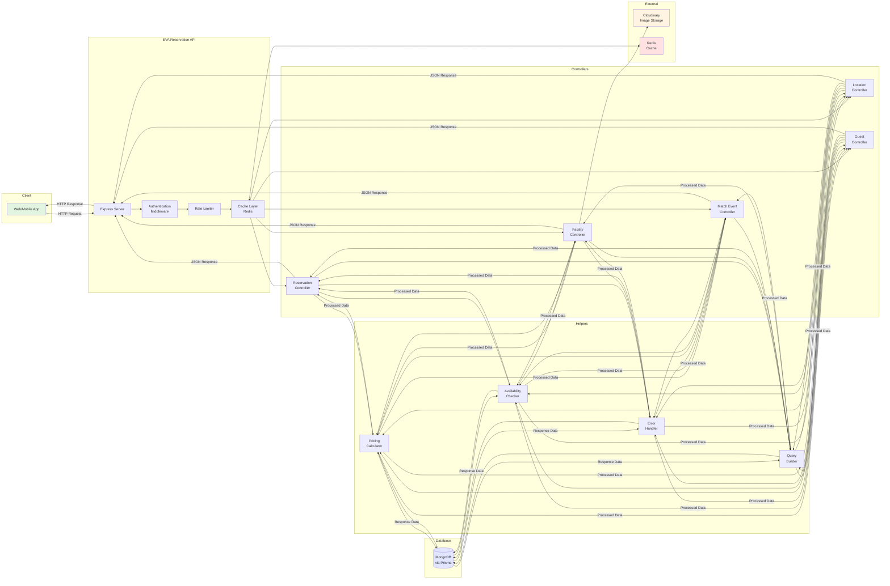

# System Architecture & Data Flow

This diagram shows the high-level architecture of the EVA Reservation API and how data flows through the system.



## Architecture Overview

The EVA Reservation API follows a **layered architecture** pattern with clear separation of concerns:

1. **Client Layer**: Web and mobile applications
2. **API Gateway Layer**: Express server with middleware
3. **Controller Layer**: Business logic and request handling
4. **Helper/Service Layer**: Reusable utilities and complex operations
5. **Data Layer**: Database access via Prisma ORM
6. **External Services**: Cloud storage and caching

---

## Layer Breakdown

### 1. Client Layer

**Web/Mobile Applications** that consume the API:
- Single Page Applications (React, Vue, Angular)
- Mobile apps (React Native, Flutter, Native iOS/Android)
- Third-party integrations

**Communication:**
- RESTful HTTP requests
- JSON payload format
- JWT tokens for authentication
- Standard HTTP methods (GET, POST, PUT, PATCH, DELETE)

---

### 2. API Gateway Layer (Express Server)

**Components:**

#### Express Server
- Main application entry point
- Route registration and management
- Request/response handling
- CORS configuration
- Error handling middleware

#### Authentication Middleware
- Validates JWT tokens
- Extracts user information
- Verifies user permissions
- Handles token refresh
- Protects routes based on authentication status

**Implementation:**
```typescript
// middleware/verifyToken.ts
export const verifyToken = async (req, res, next) => {
  const token = req.headers.authorization?.split(' ')[1];
  if (!token) return res.status(401).json({ error: 'Unauthorized' });
  
  try {
    const decoded = jwt.verify(token, process.env.JWT_SECRET);
    req.user = decoded;
    next();
  } catch (error) {
    res.status(401).json({ error: 'Invalid token' });
  }
};
```

#### Rate Limiter
- Prevents API abuse
- Configurable limits per endpoint
- IP-based and user-based limiting
- Different limits for authenticated vs. anonymous users

**Configuration:**
```typescript
// middleware/rateLimiter.ts
export const apiLimiter = rateLimit({
  windowMs: 15 * 60 * 1000, // 15 minutes
  max: 100, // limit each IP to 100 requests per windowMs
  standardHeaders: true,
  legacyHeaders: false,
});
```

#### Cache Layer
- Redis-based caching
- Reduces database load
- Caches frequently accessed data (facilities, locations, rate types)
- Cache invalidation on updates
- TTL (Time To Live) configuration

**Cache Strategy:**
```typescript
// Frequently read, rarely updated
- Facilities: TTL 1 hour
- Locations: TTL 1 hour
- Rate Types: TTL 30 minutes
- Availability: TTL 5 minutes
```

---

### 3. Controller Layer

Each controller handles a specific domain:

#### Reservation Controller
**Responsibilities:**
- Create, read, update, delete reservations
- Check-in/check-out operations
- Reservation extensions
- Cancellation handling
- Pricing calculations

**Key Endpoints:**
```typescript
POST   /api/reservations           // Create reservation
GET    /api/reservations           // List reservations
GET    /api/reservations/:id       // Get reservation details
PATCH  /api/reservations/:id       // Update reservation
DELETE /api/reservations/:id       // Cancel reservation
POST   /api/reservations/:id/checkin   // Check-in
POST   /api/reservations/:id/checkout  // Check-out
POST   /api/reservations/:id/extend    // Extend booking
```

#### Facility Controller
**Responsibilities:**
- Facility CRUD operations
- Facility search and filtering
- Availability checking
- Status management
- Image upload/management

**Key Endpoints:**
```typescript
POST   /api/facilities             // Create facility
GET    /api/facilities             // List/search facilities
GET    /api/facilities/:id         // Get facility details
PUT    /api/facilities/:id         // Update facility
DELETE /api/facilities/:id         // Delete facility
GET    /api/facilities/:id/availability  // Check availability
POST   /api/facilities/:id/images  // Upload images
```

#### Match Event Controller
**Responsibilities:**
- Match event creation and management
- Participant management
- Join requests and approvals
- Waitlist handling
- Event status updates

**Key Endpoints:**
```typescript
POST   /api/match-events           // Create match event
GET    /api/match-events           // List events
GET    /api/match-events/:id       // Get event details
PATCH  /api/match-events/:id       // Update event
POST   /api/match-events/:id/join  // Join event
POST   /api/match-events/:id/approve/:participantId  // Approve participant
POST   /api/match-events/:id/waitlist  // Join waitlist
```

#### Location Controller
**Responsibilities:**
- Location hierarchy management
- CRUD operations
- Parent-child relationships
- Location search

**Key Endpoints:**
```typescript
POST   /api/locations              // Create location
GET    /api/locations              // List locations
GET    /api/locations/:id          // Get location details
GET    /api/locations/:id/children // Get child locations
PUT    /api/locations/:id          // Update location
DELETE /api/locations/:id          // Delete location
```

#### Guest Controller
**Responsibilities:**
- Guest information management
- Guest CRUD operations
- Guest-reservation associations
- Guest history

**Key Endpoints:**
```typescript
POST   /api/guests                 // Create guest
GET    /api/guests                 // List guests
GET    /api/guests/:id             // Get guest details
PUT    /api/guests/:id             // Update guest
```

---

### 4. Helper/Service Layer

Reusable business logic components:

#### Pricing Calculator
**Responsibilities:**
- Calculate base pricing from rate types
- Apply time-based calculations (hourly, daily, etc.)
- Calculate service fees
- Apply taxes
- Process discounts and coupons
- Calculate extension fees

**Functions:**
```typescript
// helper/reservation-pricing.ts
export class ReservationPricingHelper {
  calculateBasePrice(rateType, bookingPeriod)
  calculateServiceFee(basePrice)
  calculateTax(subtotal, taxPercentage)
  applyDiscount(subtotal, discountCode)
  calculateExtensionFee(additionalHours, hourlyRate)
  calculateTotal(pricingComponents)
}
```

#### Availability Checker
**Responsibilities:**
- Check facility availability
- Validate booking periods
- Detect conflicts
- Handle buffer times
- Check maintenance schedules

**Functions:**
```typescript
// helper/reservation-availability.ts
export class AvailabilityHelper {
  checkFacilityAvailability(facilityId, startTime, endTime)
  getAvailableTimeSlots(facilityId, date)
  validateBookingPeriod(startTime, endTime)
  checkConflicts(facilityId, bookingPeriod)
}
```

#### Error Handler
**Responsibilities:**
- Standardized error responses
- Error logging
- Error categorization
- Stack trace management

**Error Types:**
```typescript
// helper/error-handler.ts
export class ErrorHandler {
  ValidationError      // 400 Bad Request
  AuthenticationError  // 401 Unauthorized
  ForbiddenError      // 403 Forbidden
  NotFoundError       // 404 Not Found
  ConflictError       // 409 Conflict
  ServerError         // 500 Internal Server Error
}
```

#### Query Builder
**Responsibilities:**
- Dynamic query construction
- Filter parsing
- Sorting and pagination
- Complex query optimization
- Multi-tenant filtering

**Functions:**
```typescript
// helper/query-builder.ts
export class QueryBuilder {
  buildFilters(queryParams)
  applyPagination(query, page, limit)
  applySorting(query, sortField, sortOrder)
  applyOrganizationFilter(query, organizationId)
}
```

---

### 5. Data Layer

#### MongoDB via Prisma ORM
**Characteristics:**
- Document-oriented NoSQL database
- Flexible schema with JSON fields
- Strong typing via Prisma
- Automatic migrations
- Connection pooling

**Prisma Features:**
- Type-safe database queries
- Auto-generated types
- Migration management
- Query optimization
- Relation handling

**Example Prisma Query:**
```typescript
const reservation = await prisma.reservation.create({
  data: {
    organizationId: "org_123",
    user: { userId: "user_456", email: "user@example.com" },
    facilityId: "facility_789",
    status: "PENDING",
    guestCount: 2,
    bookingPeriod: {
      startDateTime: new Date("2026-01-15T10:00:00Z"),
      endDateTime: new Date("2026-01-15T12:00:00Z"),
      numberOfDays: 1,
      numberOfHours: 2
    }
  },
  include: {
    facility: true,
    guests: true
  }
});
```

---

### 6. External Services

#### Cloudinary (Image Storage)
**Purpose:**
- Store facility images
- Image optimization and transformation
- CDN delivery
- Multiple image formats support

**Usage:**
```typescript
// Facility image upload
POST /api/facilities/:id/images
- Uploads to Cloudinary
- Stores URL in facility.images[]
- Supports multiple image types (COVER, GALLERY, FLOOR_PLAN, etc.)
```

#### Redis (Cache & Session Storage)
**Purpose:**
- Cache frequently accessed data
- Session management
- Rate limiting data
- Real-time data (availability)

**Cache Keys:**
```typescript
facility:{id}              // Individual facility
facilities:org:{orgId}     // Organization facilities
availability:{facilityId}  // Availability data
rateType:{id}             // Rate type details
```

---

## Request Flow Example

### Creating a Reservation

```
1. Client sends POST request to /api/reservations
   ↓
2. Express server receives request
   ↓
3. Authentication middleware validates JWT token
   ↓
4. Rate limiter checks request count
   ↓
5. Request reaches Reservation Controller
   ↓
6. Controller calls Availability Checker
   ↓
7. Availability Checker queries MongoDB via Prisma
   ↓
8. If available, Controller calls Pricing Calculator
   ↓
9. Pricing Calculator retrieves RateType from MongoDB (or cache)
   ↓
10. Controller creates Reservation record in MongoDB
    ↓
11. Controller creates Guest records in MongoDB
    ↓
12. Controller returns success response to client
    ↓
13. Response passes through Express middleware
    ↓
14. Client receives JSON response
```

---

## Security Layers

### 1. Input Validation
- Zod schema validation
- Request body validation
- Query parameter validation

### 2. Authentication
- JWT token verification
- Token expiration checks
- Refresh token handling

### 3. Authorization
- Role-based access control (RBAC)
- Organization-level isolation
- Resource ownership verification

### 4. Rate Limiting
- IP-based limiting
- User-based limiting
- Endpoint-specific limits

### 5. Data Sanitization
- SQL injection prevention (via Prisma)
- XSS prevention
- NoSQL injection prevention

---

## Performance Optimizations

### 1. Caching Strategy
```typescript
// Read operations with cache
1. Check Redis cache
2. If cache hit → return cached data
3. If cache miss → query MongoDB
4. Store result in Redis
5. Return data
```

### 2. Database Indexing
- Indexed fields: organizationId, facilityId, status, dates
- Compound indexes for common queries
- Text indexes for search

### 3. Query Optimization
- Select only required fields
- Use pagination for large datasets
- Limit nested relations
- Aggregate queries when possible

### 4. Connection Pooling
- MongoDB connection pooling via Prisma
- Redis connection pooling
- Prevents connection exhaustion

---

## Monitoring & Logging

### Application Logging
```typescript
// helper/logger.ts
- Info logs: info.log
- Error logs: error.log
- Exception logs: exception.log
- Rejection logs: rejection.log
```

### Metrics Collection
```typescript
// config/metrics.config.ts
- Request count
- Response times
- Error rates
- Cache hit rates
```

### Health Checks
```typescript
GET /health
- Database connectivity
- Redis connectivity
- External services status
```

---

## Deployment Architecture

```
┌─────────────────┐
│   Load Balancer │
└────────┬────────┘
         │
    ┌────┴────┬────────┬────────┐
    │         │        │        │
┌───▼───┐ ┌──▼───┐ ┌──▼───┐ ┌──▼───┐
│ Node 1│ │Node 2│ │Node 3│ │Node 4│
└───┬───┘ └──┬───┘ └──┬───┘ └──┬───┘
    │        │        │        │
    └────────┴────────┴────────┘
             │
    ┌────────┴────────┐
    │                 │
┌───▼─────┐     ┌────▼────┐
│ MongoDB │     │  Redis  │
│ Cluster │     │ Cluster │
└─────────┘     └─────────┘
```

### Scaling Strategy
- **Horizontal Scaling**: Add more Node.js instances
- **Database Sharding**: Partition by organizationId
- **Redis Clustering**: Distributed cache
- **CDN**: Static assets and images via Cloudinary
