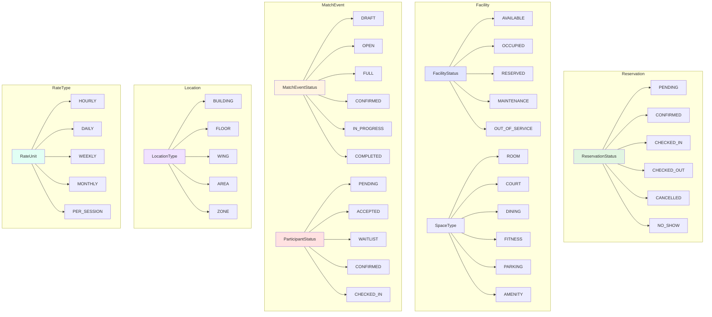

# Key Enums & Types Reference

This diagram provides a visual reference for all enumerations and their possible values used throughout the EVA Reservation API.



---

## Complete Enum Definitions

### 1. Reservation Enums

#### ReservationStatus
Tracks the lifecycle of a reservation.

```typescript
enum ReservationStatus {
  PENDING       // Reservation created, awaiting confirmation
  CONFIRMED     // Payment received, reservation confirmed
  CHECKED_IN    // Guest has arrived and checked in
  CHECKED_OUT   // Guest has completed checkout
  CANCELLED     // Reservation cancelled
  NO_SHOW       // Guest did not show up
}
```

**Usage Example:**
```typescript
// Create reservation
const reservation = await prisma.reservation.create({
  data: { status: ReservationStatus.PENDING, ... }
});

// After payment
await prisma.reservation.update({
  where: { id: reservationId },
  data: { status: ReservationStatus.CONFIRMED }
});
```

---

### 2. Facility Enums

#### FacilityStatus
Current operational status of a facility.

```typescript
enum FacilityStatus {
  AVAILABLE        // Ready to be reserved/used
  OCCUPIED         // Currently in use
  RESERVED         // Reserved but not yet occupied
  MAINTENANCE      // Under maintenance/repair
  CLEANING         // Being cleaned/prepared
  OUT_OF_SERVICE   // Temporarily unavailable
  BLOCKED          // Manually blocked (not available for booking)
}
```

**Workflow:**
```
AVAILABLE → RESERVED (when booked)
RESERVED → OCCUPIED (when checked in)
OCCUPIED → CLEANING (when checked out)
CLEANING → AVAILABLE (when ready)

Any status → MAINTENANCE (when needed)
MAINTENANCE → AVAILABLE (when fixed)

Any status → OUT_OF_SERVICE (emergencies)
OUT_OF_SERVICE → MAINTENANCE → AVAILABLE
```

#### SpaceType
High-level categorization of facility types.

```typescript
enum SpaceType {
  ROOM       // Indoor enclosed spaces (hotel rooms, conference rooms, offices)
  COURT      // Sports/recreation courts (tennis, basketball, etc.)
  DINING     // Food & beverage spaces (restaurant, cafe, bar)
  FITNESS    // Gym and fitness facilities
  PARKING    // Parking spaces/lots
  AMENITY    // Pool, spa, lounge, etc.
  OUTDOOR    // Outdoor spaces (garden, terrace, etc.)
  OTHER      // Other types not covered above
}
```

#### Court Subtypes
Specific types of sports courts.

```typescript
enum CourtSubtype {
  TENNIS
  BASKETBALL
  VOLLEYBALL
  BADMINTON
  SQUASH
  RACQUETBALL
  PICKLEBALL
  MULTIPURPOSE
  OTHER
}
```

**Example Facility:**
```typescript
{
  spaceType: SpaceType.COURT,
  subtype: CourtSubtype.BASKETBALL,
  metadata: {
    surfaceType: "Hardwood",
    isIndoor: true,
    hasLights: true,
    maxPlayers: 10
  }
}
```

#### Room Subtypes
Types of room facilities.

```typescript
enum RoomSubtype {
  GUEST_ROOM        // Hotel/accommodation rooms
  CONFERENCE_ROOM   // Meeting/conference rooms
  OFFICE            // Office spaces
  STUDIO            // Photography/recording studio
  CLASSROOM         // Training/education rooms
  BALLROOM          // Event/banquet halls
  SUITE             // Multi-room suites
  OTHER
}
```

#### Dining Subtypes
Types of dining facilities.

```typescript
enum DiningSubtype {
  FINE_DINING
  CASUAL_DINING
  CAFE
  BAR
  LOUNGE
  BUFFET
  PRIVATE_DINING
  FOOD_COURT
  OTHER
}
```

#### Fitness Subtypes
Types of fitness facilities.

```typescript
enum FitnessSubtype {
  WEIGHT_ROOM
  CARDIO_AREA
  YOGA_STUDIO
  SPIN_STUDIO
  CROSSFIT_BOX
  PILATES_STUDIO
  MULTIPURPOSE
  OTHER
}
```

#### Parking Subtypes
Types of parking facilities.

```typescript
enum ParkingSubtype {
  COVERED
  OPEN_LOT
  GARAGE
  VALET
  EV_CHARGING
  DISABLED
  MOTORCYCLE
  BICYCLE
  OTHER
}
```

#### Amenity Subtypes
Types of amenity facilities.

```typescript
enum AmenitySubtype {
  SWIMMING_POOL
  HOT_TUB
  SAUNA
  STEAM_ROOM
  SPA
  LIBRARY
  BUSINESS_CENTER
  GAME_ROOM
  LOUNGE
  ROOFTOP
  GARDEN
  OTHER
}
```

#### Facility Image Types
Categories for facility images.

```typescript
enum FacilityImageType {
  COVER         // Main cover/hero image
  FEATURED      // Featured images
  GALLERY       // Gallery images
  THUMBNAIL     // Thumbnail/preview image
  FLOOR_PLAN    // Floor plan/layout image
  EXTERIOR      // Exterior view
  INTERIOR      // Interior view
  AMENITY       // Amenity-specific image
  OTHER
}
```

---

### 3. Match Event Enums

#### MatchEventStatus
Lifecycle of a match event.

```typescript
enum MatchEventStatus {
  DRAFT           // Event created but not yet published
  OPEN            // Accepting participants
  FULL            // All slots filled, accepting waitlist
  CONFIRMED       // Event confirmed, all participants confirmed
  IN_PROGRESS     // Event is currently happening
  COMPLETED       // Event has finished
  CANCELLED       // Event was cancelled
}
```

**Lifecycle Flow:**
```
DRAFT → OPEN → FULL → CONFIRMED → IN_PROGRESS → COMPLETED
  ↓                                      ↓
CANCELLED                             CANCELLED
```

#### ParticipantStatus
Status of a participant in a match event.

```typescript
enum ParticipantStatus {
  PENDING         // Request to join pending approval
  ACCEPTED        // Accepted into the event
  REJECTED        // Request rejected
  WAITLIST        // On waitlist (event full)
  CONFIRMED       // Confirmed attendance
  CHECKED_IN      // Attended the event
  NO_SHOW         // Did not attend
  LEFT            // Left the event early
}
```

**Participant Flow:**
```
Join Request → PENDING
  ↓
  ├─→ ACCEPTED → CONFIRMED → CHECKED_IN
  ├─→ REJECTED
  └─→ WAITLIST → (promoted) → ACCEPTED

From CONFIRMED or CHECKED_IN:
  ├─→ NO_SHOW (didn't attend)
  └─→ LEFT (left early)
```

---

### 4. Location Enums

#### LocationType
Types of locations in hierarchical structure.

```typescript
enum LocationType {
  BUILDING          // Main structures (hotels, towers, buildings)
  FLOOR             // Individual floor levels
  WING              // Building wings/sections spanning multiple floors
  AREA              // Functional areas (lobby, corridor, atrium)
  ZONE              // Functional zones (residential, commercial, restricted)
  SECTION           // Organizational sections (Section A, Block 1)
  BLOCK             // Building blocks
  OUTDOOR           // Outdoor spaces (garden, terrace, plaza)
  OTHER
}
```

**Hierarchy Example:**
```
BUILDING: "Grand Hotel"
  ├─ FLOOR: "Ground Floor"
  │   ├─ AREA: "Main Lobby"
  │   └─ AREA: "Reception"
  ├─ FLOOR: "2nd Floor"
  │   ├─ WING: "East Wing"
  │   │   └─ ZONE: "Residential"
  │   └─ WING: "West Wing"
  │       └─ ZONE: "Commercial"
  └─ OUTDOOR: "Rooftop Garden"
```

#### BuildingType
Types of building structures.

```typescript
enum BuildingType {
  MAIN
  ANNEX
  TOWER
  PAVILION
  COTTAGE
  VILLA
  CLUBHOUSE
  STANDALONE
  OTHER
}
```

#### AreaType
Types of functional areas.

```typescript
enum AreaType {
  LOBBY
  CORRIDOR
  ATRIUM
  COURTYARD
  ROOFTOP
  BASEMENT
  MEZZANINE
  TERRACE
  GARDEN
  PARKING_LEVEL
  STORAGE
  MECHANICAL
  SERVICE
  OTHER
}
```

#### ZoneType
Types of functional zones.

```typescript
enum ZoneType {
  RESIDENTIAL
  COMMERCIAL
  RECREATIONAL
  ADMINISTRATIVE
  SERVICE
  RESTRICTED
  PUBLIC
  PRIVATE
  VIP
  OTHER
}
```

---

### 5. Rate Type Enums

#### RateUnit
Billing units for pricing.

```typescript
enum RateUnit {
  HOURLY        // Per hour
  DAILY         // Per day
  WEEKLY        // Per week
  MONTHLY       // Per month
  PER_SESSION   // Per session/booking
  PER_PERSON    // Per person
  FLAT_RATE     // One-time flat rate
}
```

**Usage Examples:**
```typescript
// Tennis Court - Hourly
{
  name: "Tennis Court Standard Rate",
  baseRate: 500.00,
  rateUnit: RateUnit.HOURLY,
  currency: "PHP"
}

// Hotel Room - Daily
{
  name: "Deluxe Room Rate",
  baseRate: 5000.00,
  rateUnit: RateUnit.DAILY,
  currency: "PHP"
}

// Conference Room - Per Session
{
  name: "Half-Day Conference Rate",
  baseRate: 3000.00,
  rateUnit: RateUnit.PER_SESSION,
  currency: "PHP"
}

// Fitness Class - Per Person
{
  name: "Yoga Class Rate",
  baseRate: 300.00,
  rateUnit: RateUnit.PER_PERSON,
  currency: "PHP"
}
```

---

### 6. User & Person Enums

#### Status (User)
User account status.

```typescript
enum Status {
  active
  inactive
  suspended
  archived
}
```

#### GenderType
Gender options for person records.

```typescript
enum GenderType {
  male
  female
  other
  prefer_not_to_say
  unknown
  not_applicable
}
```

#### PhoneType
Types of phone numbers.

```typescript
enum PhoneType {
  mobile
  home
  work
  emergency
  fax
  pager
  main
  other
}
```

#### IdentificationType
Types of identification documents.

```typescript
enum IdentificationType {
  passport
  drivers_license
  national_id
  postal_id
  voters_id
  senior_citizen_id
  company_id
  school_id
}
```

---

## Complex Types (Non-Enums)

### Reservation Types

#### reservationPeriod
```typescript
type reservationPeriod {
  startDateTime   DateTime
  endDateTime     DateTime
  numberOfDays    Int
  numberOfHours   Float?
  originalHours   Float?
  extendedHours   Float?
  checkedInAt     DateTime?
  checkedOutAt    DateTime?
}
```

#### PricingBase
```typescript
type PricingBase {
  planBasePrice  Float
  daysBooked     Int
  planTotal      Float
}
```

#### Charges
```typescript
type Charges {
  serviceFee    Float @default(0)
  extensionFee  Float @default(0)
  addonFee      Float @default(0)
}
```

#### Taxes
```typescript
type Taxes {
  tax            Float
  taxPercentage  Float @default(12)
}
```

#### Discounts
```typescript
type Discounts {
  couponCode          String?
  discount            Float @default(0)
  discountPercentage  Float?
}
```

#### Totals
```typescript
type Totals {
  subtotal     Float
  totalAmount  Float
}
```

---

## Enum Usage Guidelines

### 1. Validation
Always validate enum values on both client and server:

```typescript
import { z } from 'zod';

const ReservationStatusSchema = z.enum([
  'PENDING',
  'CONFIRMED',
  'CHECKED_IN',
  'CHECKED_OUT',
  'CANCELLED',
  'NO_SHOW'
]);
```

### 2. Type Safety
Use TypeScript enums for type safety:

```typescript
import { ReservationStatus } from '@prisma/client';

function updateReservationStatus(
  id: string,
  status: ReservationStatus
): Promise<Reservation> {
  return prisma.reservation.update({
    where: { id },
    data: { status }
  });
}
```

### 3. Database Queries
Filter by enum values:

```typescript
// Get all confirmed reservations
const confirmedReservations = await prisma.reservation.findMany({
  where: {
    status: 'CONFIRMED',
    organizationId: 'org_123'
  }
});

// Get available facilities
const availableFacilities = await prisma.facility.findMany({
  where: {
    status: 'AVAILABLE',
    spaceType: 'COURT'
  }
});
```

### 4. Frontend Display
Map enum values to user-friendly labels:

```typescript
const statusLabels = {
  PENDING: 'Pending Confirmation',
  CONFIRMED: 'Confirmed',
  CHECKED_IN: 'Checked In',
  CHECKED_OUT: 'Completed',
  CANCELLED: 'Cancelled',
  NO_SHOW: 'No Show'
};

const statusColors = {
  PENDING: 'yellow',
  CONFIRMED: 'green',
  CHECKED_IN: 'blue',
  CHECKED_OUT: 'gray',
  CANCELLED: 'red',
  NO_SHOW: 'orange'
};
```

---

## API Response Examples

### Reservation with Enums
```json
{
  "id": "65a1b2c3d4e5f6g7h8i9j0k1",
  "status": "CONFIRMED",
  "facility": {
    "id": "facility_123",
    "spaceType": "COURT",
    "subtype": "BASKETBALL",
    "status": "RESERVED"
  },
  "bookingPeriod": {
    "startDateTime": "2026-01-15T10:00:00Z",
    "endDateTime": "2026-01-15T12:00:00Z",
    "numberOfHours": 2
  }
}
```

### Match Event with Enums
```json
{
  "id": "match_456",
  "status": "OPEN",
  "participants": [
    {
      "id": "participant_789",
      "status": "ACCEPTED",
      "joinedAt": "2026-01-10T08:00:00Z"
    },
    {
      "id": "participant_012",
      "status": "PENDING",
      "joinedAt": "2026-01-10T09:00:00Z"
    },
    {
      "id": "participant_345",
      "status": "WAITLIST",
      "joinedAt": "2026-01-10T10:00:00Z"
    }
  ]
}
```
