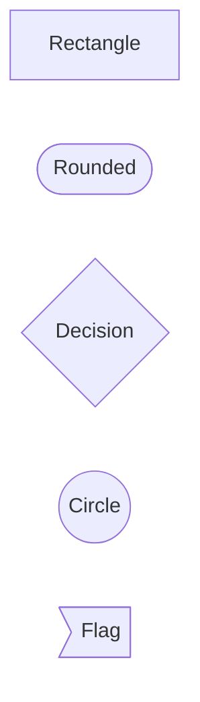
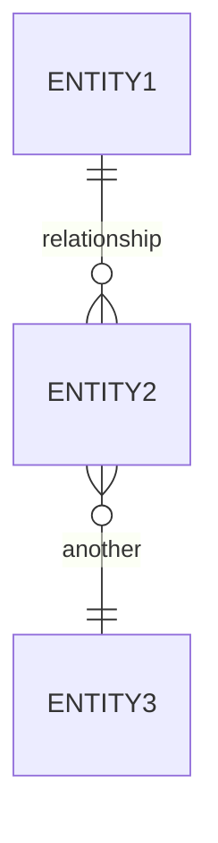
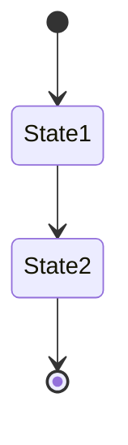

# EVA Reservation API - Diagrams Documentation

This directory contains comprehensive diagrams documenting the EVA Reservation API system architecture, data flows, and database structure.

## 📊 Diagram Index

### 1. [Database Entity Relationship Diagram (ERD)](./1-database-erd.md)
Complete visualization of all database entities and their relationships.

**What you'll find:**
- All database models and their fields
- Primary and foreign key relationships
- One-to-many and many-to-many relationships
- Entity constraints and indexes

**Best for:** Understanding the complete data model and how entities relate to each other.

---

### 2. [Reservation Creation Flow](./2-reservation-creation-flow.md)
Step-by-step flowchart of the reservation creation process.

**What you'll find:**
- User authentication flow
- Facility selection and availability checking
- Pricing calculation steps
- Guest management
- Match event creation (optional)
- Confirmation process

**Best for:** Understanding how reservations are created from start to finish.

---

### 3. [Match Event & Participant Flow](./3-match-event-flow.md)
Detailed workflow for match events and participant management.

**What you'll find:**
- Event creation and publishing
- Join request process
- Approval workflows (auto-accept vs manual)
- Waitlist management
- Event lifecycle from DRAFT to COMPLETED
- Participant status transitions

**Best for:** Understanding the social/matchmaking features for sports and activities.

---

### 4. [Reservation Lifecycle](./4-reservation-lifecycle.md)
State diagram showing all possible states and transitions for reservations.

**What you'll find:**
- All reservation statuses (PENDING, CONFIRMED, CHECKED_IN, etc.)
- Valid state transitions
- Trigger conditions for each transition
- Facility status changes
- Time-based automations

**Best for:** Understanding reservation status management and state transitions.

---

### 5. [System Architecture & Data Flow](./5-system-architecture.md)
High-level system architecture and request/response flow.

**What you'll find:**
- Layered architecture breakdown
- API gateway and middleware
- Controller responsibilities
- Helper/service layer functions
- External service integrations
- Security and performance optimizations

**Best for:** Understanding the overall system design and how components interact.

---

### 6. [Key Enums & Types Reference](./6-enums-reference.md)
Complete reference of all enumerations and complex types.

**What you'll find:**
- All enum definitions
- Enum value descriptions
- Usage examples
- Complex type structures
- API response examples

**Best for:** Quick reference for valid enum values and type structures.

---

## 🎯 Quick Start Guide

### For New Developers
1. Start with [System Architecture](./5-system-architecture.md) to understand the big picture
2. Review [Database ERD](./1-database-erd.md) to understand the data model
3. Follow [Reservation Creation Flow](./2-reservation-creation-flow.md) to see a complete feature
4. Keep [Enums Reference](./6-enums-reference.md) handy for valid values

### For Frontend Developers
1. [System Architecture](./5-system-architecture.md) - API endpoints and request/response flow
2. [Enums Reference](./6-enums-reference.md) - Valid values for dropdowns and status displays
3. [Reservation Lifecycle](./4-reservation-lifecycle.md) - Status transitions for UI updates
4. [Match Event Flow](./3-match-event-flow.md) - If implementing social/matchmaking features

### For Backend Developers
1. [Database ERD](./1-database-erd.md) - Database schema and relationships
2. [System Architecture](./5-system-architecture.md) - Layer responsibilities and helper functions
3. [Reservation Creation Flow](./2-reservation-creation-flow.md) - Business logic implementation
4. [Reservation Lifecycle](./4-reservation-lifecycle.md) - State management implementation

### For Product/Business
1. [Reservation Creation Flow](./2-reservation-creation-flow.md) - User journey for bookings
2. [Match Event Flow](./3-match-event-flow.md) - Social features and participant management
3. [Reservation Lifecycle](./4-reservation-lifecycle.md) - Reservation states and policies
4. [Enums Reference](./6-enums-reference.md) - Available options and configurations

---

## 📋 Viewing the Diagrams

### Mermaid Support
All diagrams are created using [Mermaid](https://mermaid.js.org/), which is natively supported by:
- ✅ GitHub
- ✅ GitLab
- ✅ VS Code (with Mermaid extension)
- ✅ Notion
- ✅ Confluence
- ✅ Many markdown editors

### Recommended Tools

#### VS Code Extensions
- **Markdown Preview Mermaid Support** - View diagrams in preview
- **Mermaid Editor** - Interactive diagram editing

#### Online Editors
- [Mermaid Live Editor](https://mermaid.live/) - Interactive editing and export
- [Mermaid Chart](https://www.mermaidchart.com/) - Professional diagram tool

#### Browser Extensions
- **Mermaid Diagrams** (Chrome/Firefox) - Render Mermaid in any webpage

---

## 🔄 Keeping Diagrams Updated

When making changes to the codebase:

### Database Schema Changes
Update: [1-database-erd.md](./1-database-erd.md)
- Add/remove entities
- Update relationships
- Modify field definitions

### New Features or Flows
Update relevant flow diagrams:
- [2-reservation-creation-flow.md](./2-reservation-creation-flow.md)
- [3-match-event-flow.md](./3-match-event-flow.md)

### New Enums or Types
Update: [6-enums-reference.md](./6-enums-reference.md)
- Add new enum definitions
- Document usage examples
- Update type definitions

### Architecture Changes
Update: [5-system-architecture.md](./5-system-architecture.md)
- New controllers or services
- Middleware changes
- External service integrations

### Status/State Changes
Update: [4-reservation-lifecycle.md](./4-reservation-lifecycle.md)
- New states or statuses
- Modified transition rules
- Updated automation logic

---

## 📝 Diagram Syntax Quick Reference

### Flowchart Nodes

### Relationships

### State Diagram

---

## 🤝 Contributing

When contributing diagrams:

1. **Follow existing patterns** - Match the style and format
2. **Keep it simple** - Focus on clarity over complexity
3. **Add descriptions** - Include text explanations with diagrams
4. **Test rendering** - Verify diagrams render correctly
5. **Update index** - Add new diagrams to this README

---

## 📚 Additional Resources

### Related Documentation
- [API Documentation](../docs/) - OpenAPI specs and endpoint docs
- [Implementation Guides](../docs/) - Feature-specific implementation details
- [Examples](../examples/) - Code examples and use cases

### Mermaid Documentation
- [Mermaid Official Docs](https://mermaid.js.org/)
- [Flowchart Syntax](https://mermaid.js.org/syntax/flowchart.html)
- [ER Diagram Syntax](https://mermaid.js.org/syntax/entityRelationshipDiagram.html)
- [State Diagram Syntax](https://mermaid.js.org/syntax/stateDiagram.html)

---

## 📞 Questions or Issues?

If you have questions about any diagram or notice discrepancies:
1. Check the related code files
2. Review existing documentation
3. Open an issue for clarification
4. Submit a PR to fix/improve diagrams

---

**Last Updated:** January 9, 2026  
**Maintained By:** EVA Development Team
